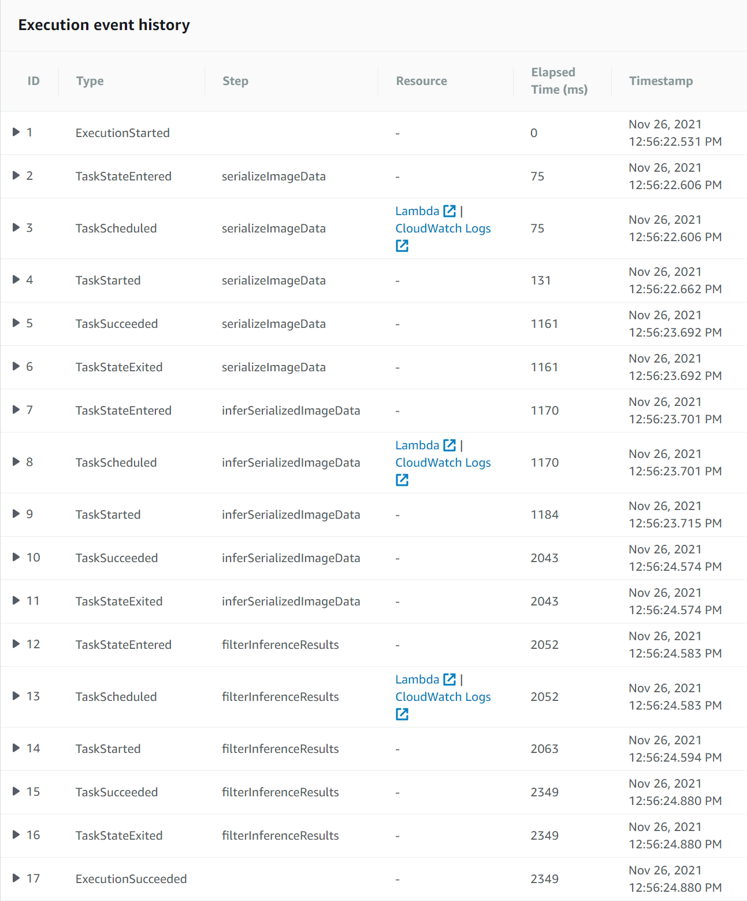
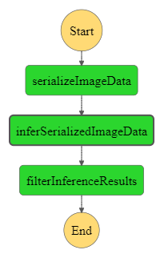
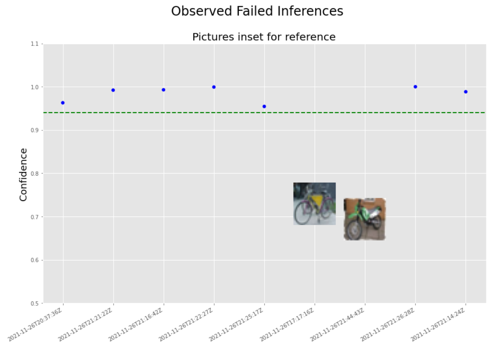

# scones_unlimited

The purpose of this project was to deploy an image classifcation model to AWS using a deployed model endpoint, AWS Lambda functions, and an AWS Step function to links Lambda functions together into a coherent workflow. The lambda functions serve 3 roles:
- Accept the address of an image hosted on S3, serialize the image, and return the image by JSON Object
- Accept a serialized image in JSON format, submit to endpoint for inference, and return inference by JSON Object
- Accept an inference in JSON format, check if the inference reaches the necessary threshold, and return by JSON object only if the inference passes a threshold.

Here is evidence of successful execution of the step function:
\

Here is the step function graph:

Here is my personal visualization:

I utilized an overlay function to place images of classifications which failed to reach our inference threshold. On a dashboard, this could help the production team to visually determine if there is a common feature in the failed inferences. In this case, the inference failures seem to come from the presence of an opaque element within the frame of a bicycle which causes the model to struggle with classification.
